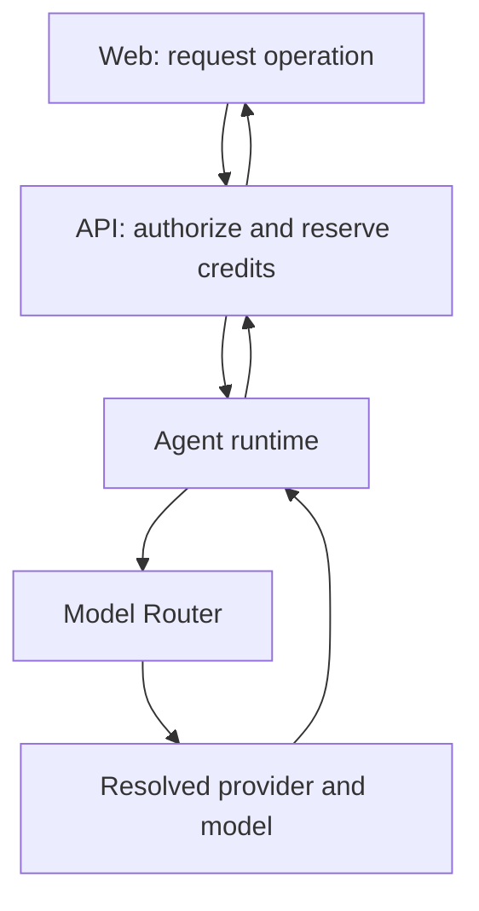

# Policy-Based Provider And Model Routing

- Status: Accepted
- Date: 2026-07-27
- Decision owner: Architecture / Founder
- Supersedes: [`2026-07-20-agent-provider-model-policy.md`](2026-07-20-agent-provider-model-policy.md)

## Context

The agent runtime already supports multiple provider/model adapters. The earlier contract allowed an API command to select a provider explicitly, with the runtime falling back to a configured default.

That mechanism is useful for development, but it is not an appropriate normal product contract. A public caller selecting an exact provider/model could bypass cost controls, privacy rules, tenant policy, capability requirements, availability handling, and centrally managed fallbacks. It would also couple `web/` and `api/` to provider-specific commercial names.

At the same time, unconstrained LLM-driven model selection would add cost, latency, and nondeterminism. Routing must be autonomous only within explicit policy and budget boundaries.

## Decision

Normal API-to-agent commands request a **workflow capability and execution constraints**, not an exact provider/model.

`api/` decides whether an operation may execute and supplies the authorized budget. `agents/` owns technical execution. A deterministic **Model Router** inside `agents/` selects the provider/model combination that satisfies the policy.

| Component | Responsibility |
| --- | --- |
| `web/` | Request a product operation and display its quoted credit cost and status. |
| `api/` | Authorize the operation, quote/reserve credits, set constraints, and own workflow state. |
| `agents/` | Execute the workflow within the authorized envelope. |
| Model Router | Resolve an allowlisted provider/model using deterministic policy and telemetry. |
| GenAI adapters | Translate the common request into provider-specific protocols and normalize output. |



Normal command inputs include:

- workflow and execution profile;
- tenant and data-classification context;
- required capabilities such as vision or structured output;
- maximum workflow cost;
- maximum input/output tokens;
- maximum model calls and tool calls;
- retry and timeout limits;
- allowed fallback behavior;
- idempotency and trace context.

Routing precedence is:

| Priority | Criterion | Nature |
| ---: | --- | --- |
| 1 | Legal, privacy, and data-residency restrictions | Mandatory |
| 2 | Required capabilities | Mandatory |
| 3 | Authorized workflow budget | Mandatory |
| 4 | Tenant policy | Mandatory or contractual |
| 5 | Provider health and availability | Operational |
| 6 | Expected quality | Optimization |
| 7 | Cost and latency | Optimization |
| 8 | Configured preference | Soft preference |
| 9 | Allowlisted fallback | Controlled recovery |

The Model Router is rule- and telemetry-driven by default. It must not call an LLM merely to choose another LLM for ordinary executions.

Exact provider/model selection remains available only as an internal, optional routing override for:

- benchmarking and controlled experiments;
- administrative incident replay;
- authorized A/B testing;
- development and contract tests;
- tenants with a contractually required provider.

Overrides require an explicit authorization such as `AI_ROUTING_OVERRIDE` and must be audited with actor, reason, requested route, resolved route, and outcome.

| Concept | Meaning | May violate mandatory policy |
| --- | --- | ---: |
| Preference | Route to use when all higher-priority conditions remain satisfied | No |
| Policy | Required cost, capability, privacy, residency, or tenant constraint | Not applicable |
| Override | Exact route requested for an authorized internal purpose | No |
| Fallback | Pre-authorized alternative compatible with the same envelope | No |

## Runtime Budget Boundary

Every workflow must enforce:

```text
maxInputTokens
maxOutputTokens
maxModelCalls
maxToolCalls
maxRetries
maxWorkflowCostUsd
timeout
idempotencyKey
```

The runtime must never autonomously increase an authorized budget or continue iterating beyond it. Budget exhaustion produces a normalized failure or an explicitly authorized degradation; it never silently switches to a more expensive path.

## Rationale

- The public API remains provider-agnostic and stable when provider catalogs change.
- Central routing can optimize cost, quality, latency, availability, and privacy consistently.
- Deterministic constraints make agent autonomy economically bounded and auditable.
- Allowlisted fallbacks provide resilience without granting arbitrary runtime freedom.
- Administrative overrides preserve testing and operational flexibility without weakening the normal trust boundary.

## Consequences

- `provider` and `model` remain mandatory resolved-output metadata for execution logs and cost attribution.
- Normal web/API DTOs must not require provider/model input.
- Existing provider/model command fields become internal/deprecated or protected override fields; migration must preserve compatibility until callers are updated.
- `api/` reserves credits and authorizes `maxWorkflowCostUsd`; it does not implement provider selection.
- `agents/` owns Model Router policy evaluation, adapter resolution, fallback, and budget enforcement.
- Tenant/provider constraints need centrally managed configuration and audit history.
- Tests must cover routing precedence, unavailable providers, capability mismatches, budget exhaustion, forbidden overrides, fallback limits, and resolved provider/model evidence.
- Current default-provider configuration becomes a final preference/fallback input, not the sole normal routing rule.

<!-- nav -->

---

← [Credit-Based Pricing](2026-07-27-credit-based-pricing.md) | [↑ inicio](#policy-based-provider-and-model-routing) | [README](README.md)
