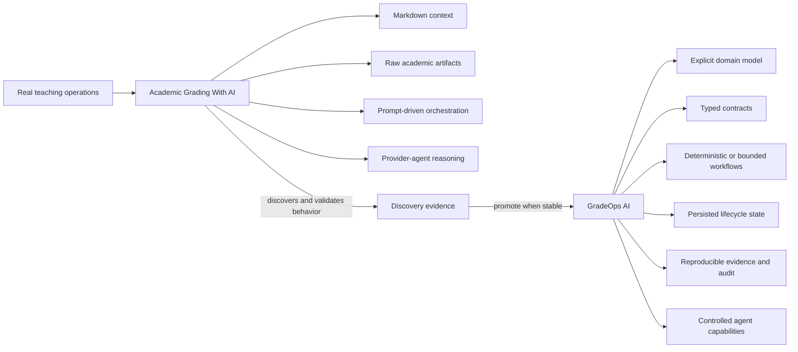

# Academic Grading With AI as Behavioral Reference Implementation

- Status: Accepted
- Date: 2026-09-04
- Scope: Product relationship, ownership, teaching operations, discovery, agentic operations, determinism boundary

## Decision

`cmartinezs/academic-grading-with-ai` is an **active founder-personal teaching asset governed under ADÜMÜN** and an **active agentic reference implementation / living behavioral prototype** for GradeOps AI.

It is not a legacy alias, a superseded predecessor, or a competing academic-operations product. ADÜMÜN governance does not imply corporate ownership: Academic Grading With AI remains a personal/docente operational asset while using the same governance, documentation, evidence and architectural standards.

GradeOps AI remains the broader product and system of record. Academic Grading With AI is the high-flexibility operational and discovery surface used in real teaching work to discover, exercise, and validate assessment workflows before recurring behavior is formalized into GradeOps AI.

## Operating model of Academic Grading With AI

Academic Grading With AI is intentionally context-driven and prompt-driven. Provider agents such as Codex or Claude operate over a workspace containing contextual Markdown and raw academic artifacts, including:

- `statement.md` and `rubric.md`;
- `base.md`, `case.md`, and `plan.md`;
- PDFs and office documents;
- student submissions and extracted evidence;
- rosters, section configuration, and form assignments;
- generated review, grading, feedback, publication, and delivery artifacts.

A significant portion of the behavior therefore lives in agent reasoning, contextual interpretation, and orchestration rather than in deterministic application code.

## Relationship to GradeOps AI

The intended discovery and convergence model is:

Academic Grading With AI discovers and exercises desired behavior in real teaching operations; GradeOps AI industrializes the behavior that becomes stable, reusable and product-worthy.

## Relationship semantics

Academic Grading With AI is a:

- teaching-operational workspace;
- behavioral reference implementation;
- discovery source for GradeOps AI;
- proving ground for agentic assessment workflows;
- source of edge cases, heuristics, interaction patterns and validation evidence.

GradeOps AI may consume and industrialize those discoveries, but it does not absorb ownership of the source workspace merely because reuse occurs.

## Extraction rule

When a behavior in Academic Grading With AI becomes frequent, stable, and important enough to reproduce consistently, evaluate it for extraction into GradeOps AI as one of:

1. deterministic domain/application logic;
2. a typed and bounded agent contract;
3. an explicit human-approval workflow;
4. structured evidence or lifecycle semantics;
5. a retained exploratory behavior in the agentic reference workspace.

Do not move behavior into deterministic code merely because it exists in the agentic workspace. Conversely, do not leave stable business rules implicit in prompts or Markdown once they have become product invariants.

## Why the reference workspace remains valuable

GradeOps AI becoming more deterministic does not obsolete Academic Grading With AI. The workspace remains useful as a fast, context-rich environment for discovering new workflows, edge cases, grading heuristics, teacher interactions, and provider-agent behavior before those patterns are promoted into the structured product.

## Canonicality and ownership

- **GradeOps AI:** canonical broader product, domain model, structured workflows, persistence, lifecycle, audit and productized agent capabilities.
- **Academic Grading With AI:** canonical active founder-personal teaching workspace, agentic reference implementation, discovery source and proving ground.
- **Governance:** both may be governed under ADÜMÜN while retaining distinct ownership and portfolio identities.

Both are valid and active, with different responsibilities and maturity characteristics.
