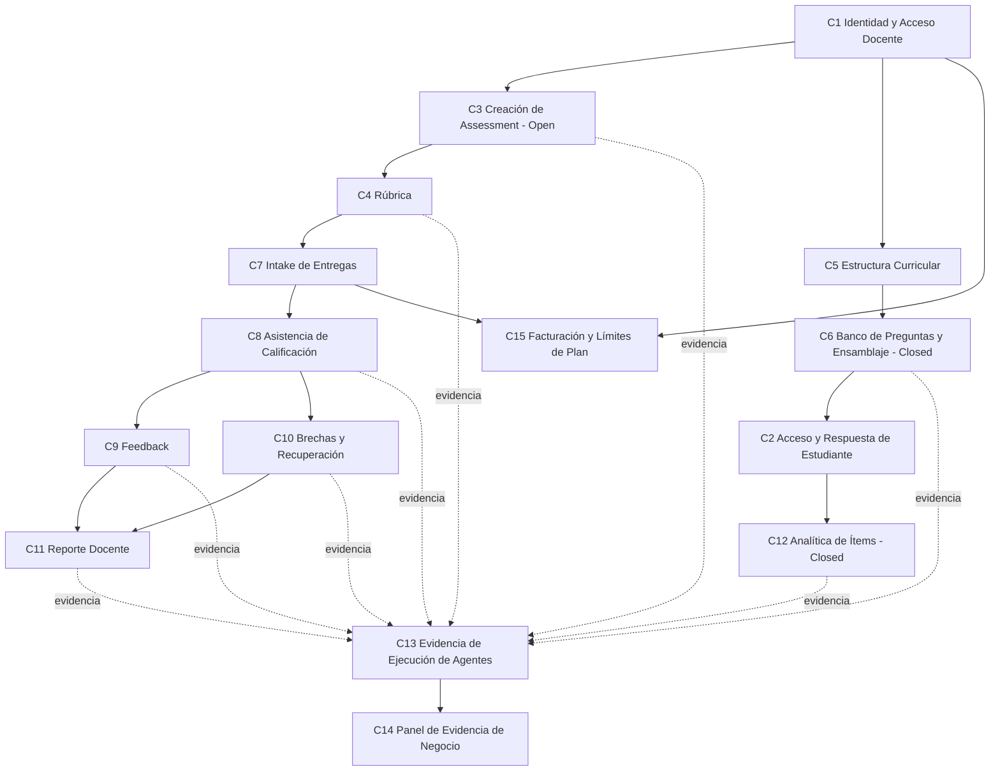

# Mapa de capacidades — GradeOps AI

> Fase 02 — Capacidades y user stories del Master Plan Ejecutivo.
> Este documento no fija la secuencia final de releases (eso es la Fase 04).

## Resumen

GradeOps AI se organiza en 15 capacidades de negocio agrupadas en 6 dominios: acceso (docente y estudiante), creación de evaluación (ambos modos), ejecución del ciclo abierto, ejecución del ciclo cerrado, evidencia/operación AI-nativa, y negocio (facturación/límites). Trece agentes de IA atraviesan horizontalmente 9 de las 15 capacidades como mecanismo de automatización, nunca como capacidad en sí mismos — son el "cómo", no el "qué".

Con **D-02 resuelta (modo Closed = P0 del hackathon)**, el mapa de capacidades ya no distingue "Open primero, Closed después": ambos modos comparten el mismo nivel de criticidad MVP, aunque su madurez de implementación real es muy distinta (ver `documentation-diagnosis.md` — solo Epic 01 y parte de Epic 02 tienen código real).

## Mapa de capacidades

| # | Capacidad | Epic(s) fuente | Dominio |
|---|---|---|---|
| C1 | Identidad y Acceso Docente | Epic 01 | Acceso |
| C2 | Acceso y Respuesta de Estudiante (sin cuenta) | Epic 13 | Acceso |
| C3 | Creación de Assessment (Open) | Epic 02 | Creación de evaluación |
| C4 | Rúbrica | Epic 03 | Creación de evaluación |
| C5 | Estructura Curricular | Epic 11 | Creación de evaluación (Closed) |
| C6 | Banco de Preguntas y Ensamblaje (Closed) | Epic 12 | Creación de evaluación (Closed) |
| C7 | Intake de Entregas | Epic 04 | Ejecución (Open) |
| C8 | Asistencia de Calificación | Epic 05 | Ejecución (Open) |
| C9 | Feedback | Epic 06 | Ejecución (Open) |
| C10 | Brechas de Aprendizaje y Recuperación | Epic 07 | Ejecución (Open) |
| C11 | Reporte Docente | Epic 08 | Ejecución (Open) |
| C12 | Analítica de Ítems (Closed) | Epic 13 (US-124) | Ejecución (Closed) |
| C13 | Evidencia de Ejecución de Agentes | Epic 09 | Evidencia / operación |
| C14 | Panel de Evidencia de Negocio | Epic 09 | Evidencia / operación |
| C15 | Facturación y Límites de Plan | Epic 10 | Negocio |

**Capacidad transversal (no vertical): Automatización / Agentes de IA.** Los 13 agentes documentados en `03-ai-agents/` no forman una capacidad propia — son el mecanismo de ejecución de C3, C4, C6 (4 agentes), C8, C9, C10 (2 agentes), C11, C12. Ver tabla de mapeo agente↔capacidad más abajo.

### Mapeo agente ↔ capacidad (confirmado historia por historia en esta fase)

| Agente | Capacidad | Historia(s) que lo invocan |
|---|---|---|
| Assessment Agent | C3 | US-011, US-012 |
| Rubric Agent | C4 | US-020 (implícito, README de epic) |
| Grading Agent | C8 | US-040 |
| Feedback Agent | C9 | US-050 |
| Learning Gap Agent | C10 | US-060 |
| Recovery Agent | C10 | US-061 |
| Teacher Report Agent | C11 | US-070 |
| Ops (Evidence) Agent | C13/C14 | US-080, US-081, US-082 (parcial — el README de C13/C14 describe generación determinística con resumen asistido por IA) |
| Question Generation Agent | C6 | US-110; posible reutilización en C5 (US-102) — **no confirmado textualmente**, ver observación abajo |
| Distractor Quality Agent | C6 | US-111 (nombrado en README de Epic 12, no en el cuerpo de la historia) |
| Ambiguity Review Agent | C6 | US-111 (mismo caso que Distractor Quality) |
| Assessment Assembly Agent | C6 | US-113 |
| Item Analytics Agent | C12 | US-124 |

**Observación de trazabilidad**: US-102 ("Generate Curriculum Structure With AI") se documentó en fases previas como reutilización del Question Generation Agent, pero el archivo real de la historia y el README de Epic 11 **no lo confirman textualmente** — solo dicen "AI proposes". Se recomienda verificar contra `03-ai-agents/question-generation-agent.md` antes de asumir esa reutilización en la Fase 03 (estrategia de automatización).

## Subcapacidades

- **C1 Identidad y Acceso Docente**: autenticación (login/registro/Google/recuperación de password), sesión y expiración, aprovisionamiento operador, aislamiento cross-teacher, flag de piloto/related-party.
- **C2 Acceso y Respuesta de Estudiante**: gestión de lista de aprendices (`LearnerRef`), envío/revocación de links firmados, respuesta vía link, publicación de resultados con control de visibilidad.
- **C3 Creación de Assessment (Open)**: intake de brief, generación de borrador vía IA, regeneración versionada.
- **C4 Rúbrica**: generación de borrador, validación de ambigüedad/pesos, aprobación con bloqueo, historial de versiones.
- **C5 Estructura Curricular**: tagging P0 (subject/topic/learning outcome), filtrado del banco por metadatos, generación de estructura con IA (P1), validación de cobertura curricular de un assessment cerrado.
- **C6 Banco de Preguntas y Ensamblaje (Closed)**: generación de lote de preguntas, curación/revisión (con flags de distractor y ambigüedad), banco buscable, composición balanceada, publicación con snapshot inmutable, anulación/recálculo auditado.
- **C7 Intake de Entregas**: creación manual, carga de archivo, importación masiva (P1), estado de procesamiento, conteo de uso facturable.
- **C8 Asistencia de Calificación**: sugerencia de score por criterio, flags de incertidumbre, edición docente, rechazo de sugerencia.
- **C9 Feedback**: borrador individual, aprobación, ajuste de tono (P1).
- **C10 Brechas de Aprendizaje y Recuperación**: resumen de brechas del cohorte, sugerencia de actividad de recuperación, notas específicas por estudiante (P1).
- **C11 Reporte Docente**: reporte consolidado del ciclo, exportación (P1).
- **C12 Analítica de Ítems (Closed)**: tasa de acierto, índice de dificultad, sugerencias de refuerzo por learning outcome.
- **C13 Evidencia de Ejecución de Agentes**: log de ejecución, estimación de costo por corrida, estimación de tiempo ahorrado (P1).
- **C14 Panel de Evidencia de Negocio**: dashboard interno con datos reales de BD (sin mocks) para evidencia de hackathon.
- **C15 Facturación y Límites de Plan**: tracking de uso vs. límite (sin bloqueo automático — regla de scope MVP), vínculo de evidencia de pago (P1).

## Actores

| Actor | Rol | Fuente |
|---|---|---|
| **Teacher** (docente de programación) | Actor primario de casi todas las capacidades; autoridad pedagógica final, aprueba todo output de IA | Todas las capacidades excepto C13/C15 (donde el actor primario es Operator) |
| **Operator** (interno GradeOps, no un rol de negocio del cliente) | Aprovisiona cuentas piloto, flaggea piloto/related-party, revisa evidencia de costo/negocio, vincula evidencia de pago | C1 (US-003, US-006), C13, C14, C15 |
| **Student / LearnerRef** | Sin cuenta; accede solo vía link firmado; responde assessment cerrado, ve sus propios resultados | C2 |
| **13 Agentes de IA** (actores de sistema) | Generan, sugieren y analizan; nunca finalizan decisiones pedagógicas ni entregan a estudiantes sin aprobación docente | Transversal — ver tabla de mapeo |

**Hallazgo de esta fase (relevante para D-05 / propuesta de historia faltante)**: **no existe ningún mecanismo de acceso definido para el actor "Operator"** — ni US-003 ni US-006 (las dos historias donde "Operator" es el actor) especifican cómo el operador se autentica. Es un "open point" citado explícitamente en el propio texto de ambas historias. Ver propuesta de US faltante más abajo.

## Relación entre capacidades

**Dependencia estructural más importante**: C13 (Evidencia de Ejecución de Agentes) es consumida por prácticamente todas las capacidades funcionales (C3-C4, C6, C8-C12), pero está modelada como si dependiera de ellas (Epic 09 declara dependencia de "Epics 02–08, 11–13"). Esta es la misma tensión de secuenciación ya señalada en la Fase 01: C13 debería tratarse como infraestructura transversal disponible desde el principio, no como un epic "downstream".

## Flujo crítico

Dado que D-02 confirma que ambos modos son P0, el flujo crítico tiene **una entrada común (C1) y dos ramas de igual criticidad**, que convergen en evidencia (C13/C14):

**Rama Open** (mayor madurez de implementación real):
- **Actor**: Teacher.
- **Evento inicial**: el docente inicia sesión y crea un brief de evaluación (C1 → C3).
- **Pasos**: brief → borrador de assessment (Assessment Agent) → rúbrica (Rubric Agent) → aprobación docente → intake de entregas → sugerencia de calificación (Grading Agent) → edición/aprobación docente → feedback (Feedback Agent) → aprobación → brechas de aprendizaje (Learning Gap + Recovery Agents) → reporte docente (Teacher Report Agent).
- **Intervenciones humanas**: aprobación de rúbrica, de cada calificación sugerida, de cada feedback, de recomendaciones de recuperación, del reporte final — ninguna se entrega/finaliza sin acción del docente.
- **Automatizaciones**: 7 agentes de IA encadenados, cada uno con `AgentExecutionLog`.
- **Resultado**: ciclo de evaluación completo, calificaciones aprobadas, feedback entregado, reporte generado.
- **Evidencia**: `AgentExecutionLog` por cada paso, `ApprovalEvent` por cada aprobación, tiempo estimado ahorrado.
- **Métrica**: North Star de `02-product/metrics.md` — "Approved feedback outputs generated for real programming submissions".

**Rama Closed** (mayor madurez de diseño, menor madurez de implementación real):
- **Actor**: Teacher (creación) → Student (respuesta, sin cuenta) → Teacher (analítica).
- **Evento inicial**: el docente etiqueta currículo y genera un lote de preguntas (C5 → C6).
- **Pasos**: generación de preguntas (Question Generation Agent) → curación con flags de calidad (Distractor Quality + Ambiguity Review Agents) → banco de preguntas → composición balanceada (Assessment Assembly Agent) → publicación con snapshot inmutable → invitación de estudiantes vía link firmado (C2) → respuesta del estudiante → calificación determinística (sin IA) contra el snapshot → publicación de resultados → analítica de ítems (Item Analytics Agent).
- **Intervenciones humanas**: curación de cada pregunta generada, aprobación de la composición antes de publicar, decisión de anular una pregunta post-grading.
- **Automatizaciones**: 4 agentes de IA en la fase de creación/curación + 1 agente de analítica post-hoc; el grading en sí es 100% determinístico (regla dura, ADR `deterministic-grading-for-closed`).
- **Resultado**: evaluación cerrada publicada, respuestas de estudiantes calificadas automáticamente, resultados y analítica disponibles.
- **Evidencia**: `AgentExecutionLog` por cada generación/curación, snapshot inmutable como evidencia de integridad, `AssessmentInvitation`/`AssessmentAttempt` como evidencia de acceso.
- **Métrica**: cobertura de learning outcomes, tasa de acierto por ítem, adopción de modo Closed en pilotos.

Ambas ramas convergen en **C13/C14** como capa de evidencia compartida — es el único punto del sistema donde "valor generado" se vuelve medible y exportable para el hackathon.

## Dependencias funcionales

- C3 y C5 dependen de C1 (no hay creación de evaluación sin identidad docente).
- C4 depende de C3 (la rúbrica se genera sobre un assessment ya creado).
- C6 depende de C5 (P0: tagging de currículo; P1: generación de currículo con IA).
- C7 depende de C4 (las entregas se califican contra una rúbrica aprobada).
- C8 depende de C7; C9 y C10 dependen de C8 (calificación es prerequisito de feedback y de detección de brechas).
- C11 depende de C8, C9 y C10 (el reporte consolida los tres).
- C2 depende de C6 (no hay acceso de estudiante sin un assessment cerrado publicado).
- C12 depende de C2 (la analítica de ítems requiere intentos de estudiante ya calificados).
- C15 depende de C1 (identidad) y C7 (el conteo de uso facturable ocurre en el análisis de la entrega).
- C13 es consumida por C3, C4, C6, C8, C9, C10, C11, C12 (ver nota de secuenciación arriba); C14 depende de C13.

## Capacidades MVP

Todas las 15 capacidades están dentro del alcance "Must Build" según `02-product/mvp-scope.md`, con la salvedad de subcapacidades P1 explícitas dentro de cada una (regeneración avanzada, exportación de reporte, tono de feedback, notas de recuperación por estudiante, generación de currículo con IA, cobertura curricular, anulación/recálculo, vínculo de evidencia de pago).

## Capacidades hackathon

Con D-02 resuelta, el corte de demo del hackathon debe cubrir, como mínimo, el camino P0 de **ambas** ramas del flujo crítico:

- C1 (completa) — ya implementada y verificada.
- C3 (completa, P0) — ya implementada y verificada (Groq/beta).
- C4 (P0: US-020, US-021, US-022) — no implementada aún.
- C7 (P0: US-030, US-031, US-033, US-034) — no implementada aún.
- C8 (completa, P0) — no implementada aún.
- C9 (P0: US-050, US-051) — no implementada aún.
- C10 (P0: US-060, US-061) — no implementada aún.
- C11 (P0: US-070) — no implementada aún.
- C5 (P0: US-100, US-101) — no implementada aún.
- C6 (P0 salvo US-115) — no implementada aún.
- C2 (completa, P0) — no implementada aún.
- C12 (P0: US-124) — no implementada aún.
- C13 (P0: US-080, US-081) — no implementada aún.
- C14 (completa, P0) — no implementada aún.
- C15 (P0: US-090) — no implementada aún.

Esto confirma cuantitativamente lo que ya señalaba la Fase 01: de 15 capacidades requeridas para el demo del hackathon, solo **2 (C1, C3)** tienen implementación real verificada a la fecha de este diagnóstico (2026-07-17), a ~4 semanas del deadline.

## Capacidades roadmap

- C4: historial de versiones de rúbrica más allá del mínimo (US-023, P1).
- C5: generación de currículo con IA y validador de cobertura completos (US-102, US-103, P1) y el modelo curricular P1 completo (jerarquía `CurriculumProvider → Framework → ...`, según `curriculum-structure.md`).
- C6: anulación/recálculo (US-115, P1).
- C7: importación masiva (US-032, P1).
- C9: ajuste de tono (US-052, P1).
- C10: notas de recuperación específicas por estudiante (US-062, P1).
- C11: exportación de reporte (US-071, P1).
- C13: estimación de tiempo ahorrado (US-083, P1).
- C15: vínculo de evidencia de pago (US-091, P1) y cualquier billing automatizado/self-serve (explícitamente fuera de MVP).
- Fuera de alcance permanente o diferido (`out-of-scope/`): chatbot de estudiante, calificación 100% autónoma, LMS completo, SSO empresarial, ingesta de papel físico (diferida, no descartada).
- Modo mixto (open+closed en un mismo assessment) — diferido explícitamente en `assessment-modes.md`.

## Historial de cambios

| Fecha | Cambio | Motivo | Elementos afectados | Decisión asociada |
|---|---|---|---|---|
| 2026-07-17 | Creación inicial | Ejecución de la Fase 02 del Master Plan Ejecutivo, tras resolver D-02 (Closed = P0) y D-03 (renumeración de IDs) | Todo el documento | D-02, D-03 |
