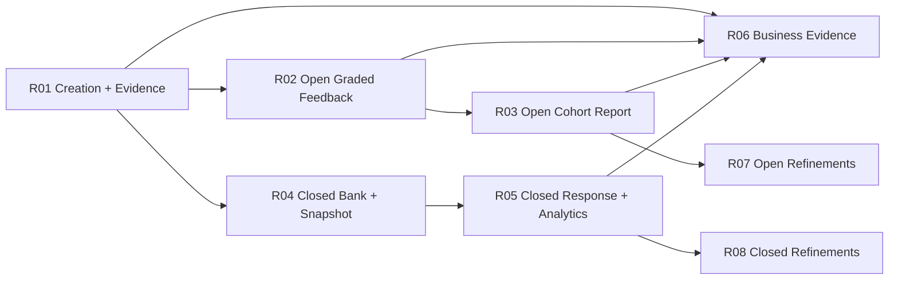

# Estrategia de releases — GradeOps AI

> Fase 04 — Planificacion de releases del Master Plan Ejecutivo.
> Este documento define la secuencia resumida. Los archivos detallados de cada release se generan en Fase 05.

## Criterios de priorizacion

La secuencia se define con estos criterios, ordenados por peso practico para el hackathon y el MVP:

| Criterio | Pregunta de decision | Peso |
|---|---|---:|
| Valor para el usuario | Permite a un docente completar o validar una parte real del workflow? | Alto |
| Evidencia | Produce logs, costos, aprobaciones o prueba de uso? | Alto |
| Impacto hackathon | Mejora demo, elegibilidad o narrativa de negocio? | Alto |
| Reduccion de riesgo | Despeja una incertidumbre critica de producto, IA, datos o despliegue? | Alto |
| Dependencias | Desbloquea varias capacidades posteriores? | Alto |
| Valor comercial | Ayuda a piloto, cobro, compromiso o prueba de demanda? | Medio |
| Esfuerzo | Cabe como release M/L sin convertirse en XL? | Medio |
| Automatizacion | Mueve un proceso a Asistida/Supervisada con trazabilidad? | Medio |
| Costo operacional | Mejora control de tokens, reintentos y costo por unidad? | Medio |
| Reversibilidad | Evita decisiones caras de deshacer durante el hackathon? | Medio |

## Scoring resumido

| Release | Valor usuario | Evidencia | Hackathon | Riesgo | Esfuerzo | Resultado |
|---|---:|---:|---:|---:|---:|---|
| R01 Assessment creation + evidence backbone | Alto | Alto | Alto | Alto | M | Primero |
| R02 Open graded feedback thin slice | Alto | Alto | Alto | Alto | L | Segundo |
| R03 Open cohort report and impact | Alto | Alto | Alto | Medio | M | Tercero |
| R04 Closed question bank to snapshot | Alto | Alto | Alto | Alto | L | Cuarto |
| R05 Closed student response and item analytics | Alto | Alto | Alto | Alto | L | Quinto |
| R06 Business evidence and hackathon compliance | Medio | Alto | Alto | Alto | M | Paralelo desde R01; cierre antes de submission |
| R07 Open workflow refinements | Medio | Medio | Medio | Bajo | M | Roadmap post-MVP |
| R08 Closed/curriculum refinements | Medio | Medio | Medio | Medio | M | Roadmap post-MVP |

## Secuencia de releases

### R01 — Assessment Creation + Evidence Backbone

| Campo | Definicion |
|---|---|
| Objetivo | Consolidar el flujo ya iniciado de login -> brief -> draft/regeneracion -> log/costo visible. |
| Problema | Existe generacion real, pero la evidencia, provider policy y reintentos deben quedar como parte del producto, no como deuda posterior. |
| Hipotesis | Si el primer flujo ya genera evidencia completa, las siguientes automatizaciones heredaran trazabilidad sin retrabajo. |
| Actor beneficiado | Teacher y Operator. |
| Valor | Primer flujo demostrable con IA real, versionado y unit economics basicos. |
| Flujo vertical | Teacher inicia sesion, crea brief, genera/regenera assessment, revisa draft, ve estado/log/costo del run. |
| Capacidades | C1, C3, C13, C15 parcial. |
| US incluidas | US-001 a US-009, US-010, US-011, US-012, US-013, US-014, US-015, US-080, US-081. |
| US propuestas requeridas | US-PROPUESTA-03, US-PROPUESTA-04, US-PROPUESTA-07 como cortes minimos. |
| Exclusiones | Rubrica, submissions, grading, feedback, modo Closed. |
| Automatizaciones | AUT-01, AUT-02, AUT-16, AUT-17, AUT-21. |
| Nivel de automatizacion | Asistida para generacion; Automatizada para logs/idempotencia/costo. |
| Evidencias | AgentExecutionLog, estimated cost, retry/failure state, provider/model policy. |
| Metricas | time to first assessment, agent log coverage, cost tracking coverage, retry rate. |
| Dependencias | D-04 y D-06 deben resolverse o quedar como supuestos tecnicos explicitos. |
| Riesgos | Gemini/Groq sin ADR; US-015 con discrepancias de DoD. |
| Complejidad | M. |
| Estado | Planificada; parte ya implementada/verificada. |

### R02 — Open Graded Feedback Thin Slice

| Campo | Definicion |
|---|---|
| Objetivo | Entregar el primer ciclo Open con una submission real: assessment -> rubrica -> submission -> grading suggestion -> feedback aprobado. |
| Problema | El producto aun no prueba el uso economico principal: una respuesta de estudiante analizada y aprobada por docente. |
| Hipotesis | Un flujo Open minimo con una o pocas submissions es suficiente para validar utilidad, confianza y costo por graded submission. |
| Actor beneficiado | Teacher. |
| Valor | Primer output estudiantil aprobado y trazable. |
| Flujo vertical | Draft aprobado -> rubrica generada/aprobada -> submission cargada -> sugerencia de calificacion -> feedback -> aprobacion docente. |
| Capacidades | C4, C7, C8, C9, C13, C15 parcial. |
| US incluidas | US-020, US-021, US-022, US-030, US-031, US-033, US-034, US-040, US-041, US-050, US-051. |
| US propuestas requeridas | US-PROPUESTA-02 como requisito de privacidad para pilotos reales; US-PROPUESTA-03/04 si no quedaron completas en R01. |
| Exclusiones | Bulk import, tone adjustment, cohort report completo, recovery, export. |
| Automatizaciones | AUT-03, AUT-04, AUT-05, AUT-06, AUT-07, AUT-16, AUT-17, AUT-21. |
| Nivel de automatizacion | Asistida/Supervisada para IA; Automatizada para validaciones, logs y usage count. |
| Evidencias | Rubric approval, submission received/analyzed, grading suggestion, feedback approval, cost per graded submission. |
| Metricas | rubric approval rate, submission processing completion, feedback approval rate, cost per graded submission. |
| Dependencias | R01; enriquecimiento de US-020/021/022/030/031/033/034/040/041/050/051 antes de atomizar. |
| Riesgos | Release L; debe mantener thin slice y evitar bulk/exports. |
| Complejidad | L, no XL si se limita a una ruta feliz + errores principales. |
| Estado | Planificada. |

### R03 — Open Cohort Report and Impact

| Campo | Definicion |
|---|---|
| Objetivo | Completar el cierre Open: ediciones/rechazos, brechas, recuperacion y reporte docente. |
| Problema | Sin reporte e impacto, el demo muestra outputs aislados pero no ahorro ni valor pedagogico agregado. |
| Hipotesis | Un reporte con brechas, decisiones docentes y costo estimado permite vender el piloto y narrar impacto. |
| Actor beneficiado | Teacher y Operator. |
| Valor | Cierre del ciclo Open con evidencia de aprendizaje y tiempo ahorrado. |
| Flujo vertical | Varias submissions procesadas -> teacher edita/aprueba/rechaza -> gaps -> recovery -> teacher report -> time-saved estimate. |
| Capacidades | C8, C10, C11, C13, C14 parcial. |
| US incluidas | US-042, US-043, US-060, US-061, US-070, US-083. |
| US propuestas requeridas | Ninguna nueva si R01/R02 cubren fallos, idempotencia y privacidad. |
| Exclusiones | Notas de recuperacion por estudiante, export report, tone adjustment. |
| Automatizaciones | AUT-06, AUT-08, AUT-09, AUT-10, AUT-16, AUT-17. |
| Nivel de automatizacion | Supervisada para interpretaciones; Automatizada para eventos/metrica. |
| Evidencias | Teacher overrides, gap summary, recovery approved, report generated, time-saved estimate. |
| Metricas | teacher override count, learning gaps detected, recovery activities approved, reports generated. |
| Dependencias | R02; enriquecer US-042/043/060/061/070/083. |
| Riesgos | Sobreinterpretacion pedagogica; marcar estimaciones como tales. |
| Complejidad | M. |
| Estado | Planificada. |

### R04 — Closed Question Bank to Snapshot

| Campo | Definicion |
|---|---|
| Objetivo | Entregar el primer flujo Closed de creacion: tags -> pregunta generada -> curacion -> banco -> composicion -> snapshot publicado. |
| Problema | Closed es P0, pero no tiene implementacion real; debe entrar como corte vertical separado para no contaminar el flujo Open. |
| Hipotesis | Un ciclo Closed hasta snapshot prueba la propuesta AI-native para evaluaciones objetivas sin depender todavia de intake masivo de estudiantes. |
| Actor beneficiado | Teacher. |
| Valor | Banco curado y assessment cerrado publicable con answer key congelada. |
| Flujo vertical | Teacher etiqueta outcome, genera preguntas, revisa flags, aprueba al banco, compone, aprueba snapshot. |
| Capacidades | C5, C6, C13. |
| US incluidas | US-100, US-101, US-110, US-111, US-112, US-113, US-114. |
| US propuestas requeridas | US-PROPUESTA-04 y US-PROPUESTA-07 si no quedaron generalizadas. |
| Exclusiones | Respuesta de estudiante, resultados, item analytics, anulacion/recalculo. |
| Automatizaciones | AUT-11, AUT-12, AUT-13, AUT-14 parcial, AUT-16, AUT-17, AUT-21. |
| Nivel de automatizacion | Asistida/Supervisada para agentes; Automatizada para snapshot y logs. |
| Evidencias | Generated question batch, curation audit trail, composition approval, frozen snapshot. |
| Metricas | approved question rate, flags resolved, coverage achieved, snapshot published. |
| Dependencias | R01; enriquecer US-100/101/110/111/112/113/114. |
| Riesgos | Factualidad/ambiguedad; no usar IA para scoring cerrado. |
| Complejidad | L. |
| Estado | Planificada. |

### R05 — Closed Student Response and Item Analytics

| Campo | Definicion |
|---|---|
| Objetivo | Completar el ciclo Closed con estudiantes sin cuenta, scoring determinista, resultados y analitica de items. |
| Problema | Un snapshot sin respuestas no prueba valor operacional ni evidencia de adopcion estudiantil. |
| Hipotesis | Links firmados + grading determinista + analitica de items prueban integridad, velocidad y valor del modo Closed. |
| Actor beneficiado | Teacher, Student/LearnerRef. |
| Valor | Primer ciclo Closed end-to-end demostrable. |
| Flujo vertical | Learner list -> links -> student response -> deterministic grading -> teacher publishes results -> item analytics. |
| Capacidades | C2, C12, C13. |
| US incluidas | US-120, US-121, US-122, US-123, US-124. |
| US propuestas requeridas | US-PROPUESTA-02 para privacidad/eliminacion; US-PROPUESTA-03 para fallos visibles. |
| Exclusiones | Anulacion/recalculo, OCR/OMR, student account, proctoring. |
| Automatizaciones | AUT-14, AUT-15, AUT-19, AUT-16, AUT-17, AUT-21. |
| Nivel de automatizacion | Automatizada para links/scoring; Supervisada para analitica y publicacion. |
| Evidencias | Invitation, attempt, grade result, result access, item analytics report. |
| Metricas | closed attempts completed, deterministic grading success, item analytics generated. |
| Dependencias | R04; enriquecer US-120/121/122/123/124. |
| Riesgos | Privacidad, deliverability, snapshot mistakes post-publish. |
| Complejidad | L. |
| Estado | Planificada. |

### R06 — Business Evidence and Hackathon Compliance

| Campo | Definicion |
|---|---|
| Objetivo | Preparar evidencia real de negocio, costos, revenue, usuarios y cumplimiento de entorno para el hackathon. |
| Problema | El producto puede funcionar y aun asi perder fuerza si no demuestra usuarios, costos, revenue y despliegue compatible. |
| Hipotesis | Un dashboard interno con ledger y evidencia privada/publica acelera pilotos, cobro y submission final. |
| Actor beneficiado | Operator, founder, judges/testers. |
| Valor | Evidencia comercial y operativa lista para demo y submission. |
| Flujo vertical | Operator revisa pilotos, usage, cost, revenue, related-party, evidence links y exporta paquete validado. |
| Capacidades | C14, C15, C13, C1 parcial. |
| US incluidas | US-082, US-090, US-091. |
| US propuestas requeridas | US-PROPUESTA-01, US-PROPUESTA-05, US-PROPUESTA-06, US-PROPUESTA-08. |
| Exclusiones | Self-serve billing complejo, marketplace, BI suite publica. |
| Automatizaciones | AUT-16, AUT-17, AUT-18, AUT-20, AUT-21. |
| Nivel de automatizacion | Supervisada por Operator; determinista para ledgers y alertas. |
| Evidencias | RevenueEvent, CostEvent, usage limits, related-party split, dashboard/export, GCP/Gemini proof si aplica. |
| Metricas | paid pilots, revenue by month, cost coverage, evidence completeness, agent run success rate. |
| Dependencias | D-01 debe resolverse antes de release candidate hackathon; D-07 antes de narrativa final. |
| Riesgos | D-01 sigue pendiente; dashboard puede crecer a L si se agregan demasiadas vistas. |
| Complejidad | M. |
| Estado | Planificada; debe correr en paralelo operativo desde R01. |

### R07 — Open Workflow Refinements

| Campo | Definicion |
|---|---|
| Objetivo | Mejorar eficiencia y presentacion del flujo Open despues del MVP funcional. |
| Problema | Algunas mejoras P1 aumentan ergonomia, pero no deben bloquear el primer valor. |
| Hipotesis | Version history, bulk import, tone, recovery notes y export mejoran adopcion tras pilotos iniciales. |
| Actor beneficiado | Teacher. |
| Valor | Menos trabajo manual y mejores salidas reutilizables. |
| Flujo vertical | Teacher opera assessment Open con importacion masiva, ajustes finos y export. |
| Capacidades | C4, C7, C9, C10, C11. |
| US incluidas | US-023, US-032, US-052, US-062, US-071. |
| US propuestas requeridas | Ninguna obligatoria. |
| Exclusiones | BI suite, LMS, autonomous grading. |
| Automatizaciones | AUT-03, AUT-05, AUT-07, AUT-09, AUT-10. |
| Nivel de automatizacion | Asistida/Supervisada. |
| Evidencias | Bulk import status, tone adjustments, export artifacts. |
| Metricas | import success rate, export report count, feedback edit rate. |
| Dependencias | R02/R03. |
| Riesgos | Feature breadth sin pilotos suficientes. |
| Complejidad | M. |
| Estado | Roadmap post-MVP. |

### R08 — Closed and Curriculum Refinements

| Campo | Definicion |
|---|---|
| Objetivo | Completar mejoras P1 del modo Closed y curriculum. |
| Problema | El MVP Closed puede operar con tagging simple; curriculum IA, coverage avanzado y recalculo pueden esperar. |
| Hipotesis | Despues de validar el ciclo Closed, estas mejoras aumentan calidad y confianza institucional. |
| Actor beneficiado | Teacher, small academy operator. |
| Valor | Mejor cobertura curricular, correccion auditada y opcion futura de papel/OCR. |
| Flujo vertical | Teacher genera estructura curricular, valida cobertura, anula/recalcula si corresponde y planifica ingesta diferida. |
| Capacidades | C5, C6, C12. |
| US incluidas | US-102, US-103, US-115, US-OUT-004 como investigacion futura. |
| US propuestas requeridas | US-PROPUESTA-02 si no se implemento antes para privacidad. |
| Exclusiones | Full LMS, proctoring, marketplace de bancos. |
| Automatizaciones | AUT-11, AUT-13, AUT-14, AUT-15. |
| Nivel de automatizacion | Asistida/Supervisada; Automatizada para recalculo determinista. |
| Evidencias | Coverage report, annulment/recalculation audit trail. |
| Metricas | coverage alerts resolved, recalculation events, item quality trend. |
| Dependencias | R04/R05. |
| Riesgos | Alcance institucional puede desviar el producto del MVP docente. |
| Complejidad | M. |
| Estado | Roadmap post-MVP. |

## Dependencias

Dependencias bloqueantes:

- R01 bloquea todo lo que necesite evidencia real y costo por run.
- R02 bloquea el primer uso economico Open: graded submission.
- R04 bloquea cualquier acceso estudiante Closed.
- R06 depende de D-01 para definir que cuenta como despliegue demostrable/elegible.

## Camino critico

1. **Resolver D-01**: confirmar si la submission necesita `demo` GCP/Gemini real, o si `beta` + evidencia de Gemini basta.
2. **Cerrar R01**: provider/model policy, logs, costos e idempotencia minima en assessment creation.
3. **Entregar R02**: primer graded submission con feedback aprobado y costo por submission.
4. **Entregar R03**: reporte e impacto para narrativa y pilotos.
5. **Entregar R04/R05 en thin slices**: Closed P0 con una evaluacion pequena, pocos estudiantes y analytics basica.
6. **Consolidar R06**: evidence dashboard, revenue/cost ledger, related-party split, demo package.

Pruebas tecnicas tempranas:

- E2E de agent run con log completo y costo estimado.
- Idempotencia de generacion y retry visible.
- Storage/intake de submission real con minimizacion PII.
- Snapshot cerrado inmutable y scoring determinista reproducible.
- Link firmado de estudiante con aislamiento.
- Export o screenshot verificable del dashboard de evidencia.

## Complejidad

No hay releases XL en esta estrategia. Los cortes L son verticales pero limitados:

- R02 queda L porque cruza rubrica, submission, grading y feedback; se mantiene viable si se limita a una ruta feliz y errores principales.
- R04 queda L porque introduce el dominio Closed; se limita hasta snapshot, sin estudiantes.
- R05 queda L porque completa acceso estudiante y analytics; se separa de R04 para evitar XL.

## Hitos

| Hito | Release | Evidencia esperada |
|---|---|---|
| Primer flujo end-to-end de generacion | R01 | Assessment draft + agent log completo |
| Primera llamada real de IA trazada | R01 | provider/model/tokens/costo |
| Primera revision docente | R01/R02 | approval event |
| Primer estudiante procesado | R02 | StudentSubmission + GradeSuggestion |
| Primer feedback aprobado | R02 | FeedbackDraft approved |
| Primer reporte de impacto | R03 | TeacherReport + gaps/recovery |
| Primera automatizacion supervisada | R02 | grading/feedback con aprobacion |
| Primer assessment Closed publicado | R04 | frozen snapshot |
| Primer intento Closed calificado | R05 | AssessmentAttempt + deterministic GradeResult |
| Primer piloto | R06 | CustomerEvidence |
| Primer cliente pagado o compromiso | R06 | RevenueEvent/payment evidence |
| Primera evidencia completa | R06 | dashboard/export con users, runs, costs, revenue |
| Release candidata hackathon | R06 | demo package + deployment evidence |
| Version productiva inicial | R02 o R03, segun piloto | flujo Open operable con evidencia |

## Riesgos de secuencia

| Riesgo | Donde aparece | Manejo |
|---|---|---|
| D-01 no resuelta antes de R06 | R06 | Mantener `beta` para evidencia real y crear release/hito minimo `demo` si se confirma requisito GCP. |
| Closed P0 compite con Open | R04/R05 | Separar Closed en dos releases y no adelantar refinamientos P1. |
| Evidencia tarde | Todas | R01 incluye AUT-16/AUT-17/AUT-21 como base. |
| Historias NOT READY entran directo a implementacion | R02-R08 | Ejecutar `/us-enrich` antes de atomizar cada grupo. |
| Operator sin acceso | R06 | Priorizar US-PROPUESTA-01 o definir operator como rol temporal administrado. |
| Pricing divergente | R06 | Resolver D-07 antes de narrativa final. |

## MVP, hackathon y roadmap

| Corte | Incluye | No incluye |
|---|---|---|
| MVP operativo | R01-R03 como base Open; R04-R05 como Closed P0 thin slice si el tiempo lo permite; R06 para evidencia minima | R07/R08 refinamientos P1 |
| Hackathon | R01-R06, con D-01 resuelta y evidencia real de usuarios/costos/revenue | Feature breadth, LMS, SSO enterprise, autonomous grading |
| Roadmap posterior | R07-R08 y futuras capacidades comerciales | Cambiar el principio de teacher authority |

## Historial de cambios

| Fecha | Cambio | Motivo | Elementos afectados | Decision asociada |
|---|---|---|---|---|
| 2026-07-19 | Creacion inicial | Ejecucion de la Fase 04 del Master Plan Ejecutivo | Todo el documento | D-01, D-02, D-04, D-06 |
