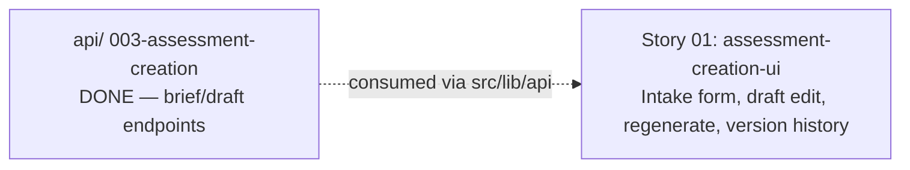

# 🚀 EXPANSION: 001-assessment-creation

> **Status:** Expansion
> [← planning/README.md](../../README.md)

---

## Story Summary

| # | Story | SDLC Phase(s) | Depends On | Risk | External Issue | Status |
|---|-------|--------------|------------|------|----------------|--------|
| 01 | assessment-creation-ui | WB | — | M | — | TODO |

---

## Dependency Map

---

## Impact per Repository Area

| Code | Area | Affected? | What changes |
|------|------|----------|-------------|
| WB | `src/` | ☑ | Intake form (RHF + Zod), submit handler, draft view/edit screen, regenerate action, version history view, component/unit tests |
| W | `.planning/` | ☑ | Este planning |

---

## Linked Child Plannings

*N/A — this is itself a child planning of the monorepo root (`.planning/active/008-assessment-creation/` at the repo root). It has no further child workspaces of its own.*

---

## Notes

- **Child planning of the monorepo root.** This planning implements the `web/` half of the parent monorepo planning `008-assessment-creation`. Sibling child plannings: `agents/.planning/001-assessment-creation` (`DONE`) and `api/.planning/003-assessment-creation` (`DONE`) — both already provide a stable contract/endpoints for this planning to integrate against; no "wait for the contract to stabilize" risk exists here the way it did for `api/`'s story (which had to track `agents/`'s contract changing mid-story).
- First planning ever executed in this `web/.planning/` workspace.
- Source stories (root docs repo): `docs/02-product/user-stories/epic-02-assessment-creation/01-assessment-brief-intake.md` (US-010), `02-assessment-draft-generation.md` (US-011), `03-assessment-draft-regeneration.md` (US-012).
- Every form uses React Hook Form + Zod (`zodResolver`) — never native HTML validation. Established project-wide convention, not new for this story.
- Types mirror the `api/` DTO contracts — no independent shared-type definitions in `web/`.
- Gemini/Groq API keys are never touched by `web/` — only `agents/` calls the LLM providers; `web/` only calls `api/` endpoints.

---

## Risk Register

| ID | Risk | Impact | Likelihood | Mitigation | Owner | Status |
|----|------|--------|------------|------------|-------|--------|
| R-01 | Draft/version-history UI is built against a stale understanding of `api/`'s response shapes | M | L | `api/003-assessment-creation` is already `DONE` and merged — verify request/response shapes directly against `api/`'s actual controller/DTO source before implementing, not against `docs/04-architecture/api-design.md` alone (already found stale relative to `api/`'s real implementation during that planning's own execution) | web/ owner | Open |

Use `L`, `M`, or `H` for impact and likelihood. Carry high risks into the related story and task files.

---

## External Issue Mapping

| Story | External System | External ID / URL | Sync Notes |
|-------|-----------------|-------------------|------------|
| 01 | — | — | — |

---

> [← planning/README.md](../../README.md)
