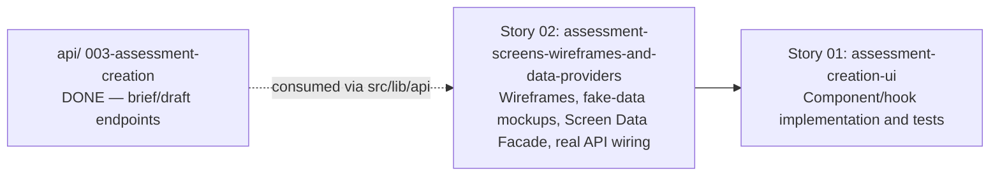

# 🚀 EXPANSION: 001-assessment-creation

> **Status:** Expansion
> [← planning/README.md](../../README.md)

---

## Story Summary

| # | Story | SDLC Phase(s) | Depends On | Risk | External Issue | Status |
|---|-------|--------------|------------|------|----------------|--------|
| 01 | assessment-creation-ui | WB | Story 02 | M | — | SKIPPED |
| 02 | assessment-screens-wireframes-and-data-providers | WB | — | M | — | TODO |

---

## Dependency Map

---

## Impact per Repository Area

| Code | Area | Affected? | What changes |
|------|------|----------|-------------|
| WB | `src/` | ☑ | Intake form (RHF + Zod), submit handler, draft view/edit screen, regenerate action, version history view, component/unit tests |
| W | `.planning/` | ☑ | Este planning |

---

## Linked Child Plannings

*N/A — this is itself a child planning of the monorepo root (`.planning/active/008-assessment-creation/` at the repo root). It has no further child workspaces of its own.*

---

## Notes

- **Child planning of the monorepo root.** This planning implements the `web/` half of the parent monorepo planning `008-assessment-creation`. Sibling child plannings: `agents/.planning/001-assessment-creation` (`DONE`) and `api/.planning/003-assessment-creation` (`DONE`) — both already provide a stable contract/endpoints for this planning to integrate against; no "wait for the contract to stabilize" risk exists here the way it did for `api/`'s story (which had to track `agents/`'s contract changing mid-story).
- First planning ever executed in this `web/.planning/` workspace.
- Source stories (root docs repo): `docs/02-product/user-stories/epic-02-assessment-creation/01-assessment-brief-intake.md` (US-010), `02-assessment-draft-generation.md` (US-011), `03-assessment-draft-regeneration.md` (US-012).
- Every form uses React Hook Form + Zod (`zodResolver`) — never native HTML validation. Established project-wide convention, not new for this story.
- Types mirror the `api/` DTO contracts — no independent shared-type definitions in `web/`.
- Gemini/Groq API keys are never touched by `web/` — only `agents/` calls the LLM providers; `web/` only calls `api/` endpoints.
- **UI action reachability:** no assessment-creation screen is considered delivered if the only way to reach it is typing the route. For R01, the existing `/dashboard` "Nueva evaluacion" action must navigate to `/assessments/new`, and unit/acceptance/e2e coverage must start the happy path from that visible action.
- **UI Design/Data Semantics:** no assessment-creation UI is considered delivered if the form treats all fields as unrestricted text inputs. Story 02 must produce a DS-first design and field matrix before wireframe/mockup: `learningGoal` is free long text, `level` is enum/difficulty, `duration` is numeric/preset with unit, `language` is enum/catalog, and `topic` is a candidate master-data/tag field with custom input only if the API/domain rule allows it.
- **API I/O + sync/async contract:** every screen datum must map to `api/` for reads and writes. If `api/` lacks a needed endpoint, catalog, read model, mutation, capability or operation state, create/track the API scope or blocking residual before closing UI. Story 02 must decide whether draft generation/regeneration remains sync or becomes async; async requires a completion model such as operation polling, SSE, WebSocket, webhook server-to-server/push notification or another explicit contract.
- **i18n:** every user-facing string in assessment creation must use i18n keys or API-provided localized labels. `web` must pass/resolve effective locale for safe errors, catalog labels and generated draft output; source code, DTO fields, status/error codes, logs and telemetry remain in English. Intake `language` is programming language, not natural-language locale.
- **Story 02 added 2026-07-15** via `/plan-enrich-epic`, following `docs/gradeops-ai-frontend-guidelines/02-ux-wireframes-y-maquetas.md`'s design flow (objetivo de usuario → wireframe → jerarquía → maqueta funcional con datos fake → conectar API real) and `06-estado-datos-y-api.md` §7 (Page Data Loader / Screen Data Facade). It owns the wireframes, fake-data mockups, DTOs/view models, and the Screen Data Facade/mutation functions for both screens (Intake, Draft Builder), plus the final real-API wiring end-to-end. Story 01 now depends on it and consumes its output for component/hook implementation and tests, instead of starting from an unspecified screen shape.

---

## Risk Register

| ID | Risk | Impact | Likelihood | Mitigation | Owner | Status |
|----|------|--------|------------|------------|-------|--------|
| R-01 | Draft/version-history UI is built against a stale understanding of `api/`'s response shapes | M | L | Verified directly against `api/`'s `AssessmentController` and DTOs during Story 02's design (2026-07-15) — see `story-02-assessment-screens-wireframes-and-data-providers.md` § Context for the exact request/response shapes; `docs/04-architecture/api-design.md` alone was already found stale relative to `api/`'s real implementation during that planning's own execution | web/ owner | Mitigated |
| R-02 | `/assessments/new` works as a deep link but the dashboard action remains unwired, so teachers cannot discover the flow from the product UI | H | H | Story 02 tasks must design, wire and test `/dashboard` "Nueva evaluacion" -> `/assessments/new`; happy-path acceptance/e2e starts from dashboard, not URL direct | web/ owner | Open |
| R-03 | Intake UI is implemented with unrestricted text inputs for `topic`, `level`, `duration` and `language`, losing enum/catalog/numeric semantics before data reaches `api/`/agents | H | H | Story 02 must apply UI Design/Data Semantics, produce the field matrix, use DS controls, and either consume/create catalog/API sources or record explicit residuals before closing R01 UI | web/ + api/ owners | Open |
| R-04 | UI requires read/write data or async status that `api/` does not expose, so implementation falls back to fixtures, timers or ungoverned local state | H | M | Story 02 tasks must map every datum/action to `api/`, create/track API gaps, and define sync/async completion before real wiring | web/ + api/ owners | Open |
| R-05 | i18n is implemented only as visible labels, while API safe errors, catalog labels, generated draft locale or logs/telemetry language drift | H | M | Story 02 tasks must include i18n gate: translation keys, locale/fallback, `outputLocale`, safe errors/catalog labels and logs/telemetry in English | web/ + api/ + agents owners | Open |

Use `L`, `M`, or `H` for impact and likelihood. Carry high risks into the related story and task files.

---

## External Issue Mapping

| Story | External System | External ID / URL | Sync Notes |
|-------|-----------------|-------------------|------------|
| 01 | — | — | — |
| 02 | — | — | — |

---

> [← planning/README.md](../../README.md)
